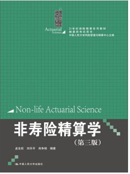

# 非寿险精算学

本课程是一门三学分课程（精算与风险管理专业必修、其他专业选修），适合风险管理、保险与精算等相关专业的**本科高年级学生**参考。 

非寿险精算主要内容是**费率厘定**、**准备金评估**和**再保险**三部分

- **损失模型**：风险度量、索赔次数、索赔金额、累积损失模型
- **费率厘定**：分类费率厘定、经验费率厘定
- **准备金评估**：未到期责任准备金、未决赔款准备金、理赔费用准备金评估
- **再保险定价**

在实证研究中，以 **R 语言** 为计算工具，提供了详细的程序代码，方便读者再现完整的编程和计算过程。

## 先修内容
需要概率论与数理统计、高等数学、线性代数、保险学的基础知识

- **概率论与数理统计**：随机变量、概率分布、中心极限定理
- **高等数学**：微积分、泰勒公式
- **线性代数**：矩阵运算
- **保险学**：基本概念和专业术语

## 课程讲义
- [Markdown 新手指南](https://www.jianshu.com/p/q81RER)
- [Markdown 语法大全](https://www.appinn.com/markdown/)
- [Week 1 - 非寿险精算简介](https://github.com/lizhengxiao/Non-life-Insurance-Actuarial-Science/blob/master/Lectures/Week%201%20-%20%E9%9D%9E%E5%AF%BF%E9%99%A9%E7%B2%BE%E7%AE%97%E7%AE%80%E4%BB%8B.ppt)
	- 课程安排
	- R 软件介绍
	- 非寿险概念
- [Week 2 - 风险度量基础](https://github.com/lizhengxiao/Non-life-Insurance-Actuarial-Science/blob/master/Lectures/Week%201%20-%20%E9%A3%8E%E9%99%A9%E5%BA%A6%E9%87%8F%E5%9F%BA%E7%A1%80.pptx)
	- VaR（在险价值）
	- TVaR（条件在险价值）/ CVaR（尾部在险价值）
	- 保费原理
- [Week 3 - 损失金额模型](https://github.com/lizhengxiao/Non-life-Insurance-Actuarial-Science/blob/master/Lectures/Week%201%20-%20%E9%A3%8E%E9%99%A9%E5%BA%A6%E9%87%8F%E5%9F%BA%E7%A1%80.pptx)
	- 指数分布、伽马分布、逆高斯分布、对数正态分布、帕累托分布、威布儿分布
	- 对数变换、指数变换
	- 混合分布
	- 案例分析

## R 代码和练习
-  [Week 2 - 风险度量](https://github.com/lizhengxiao/Non-life-Insurance-Actuarial-Science/blob/master/Codes/1.%20Risk%20Measures.r)
-  [Week 3 - 损失金额模型](https://github.com/lizhengxiao/Non-life-Insurance-Actuarial-Science/blob/master/Codes/2.%20Models%20of%20Claim%20Amount.r)

## 课后作业
1. 假设被保险人的损失 X 服从伽马分布，参数为：shape = 2，scale = 1000。两份保单如下：

	（1）保单 A 的免赔额为100。

	（2）保单 B 的免赔额为100，赔偿限额为3000。（d=100，u=3100）
	- 分别计算保险公司对保单 A 和保单 B 的期望赔款（含零赔款在内）。
	- 如果发生 10% 的通货膨胀，上述结果将如何变化？
	- 如果通胀函数为1.1x^0.5，上述结果将如何变化？
	
**要求:用R编写程序代码。**

## 教材和参考资料
- 孟生旺, 刘乐平. 非寿险精算学(第三版), 中国人民大学出版社, 2015
- [Klugman S. A., Panjer H. H., Willmot G. E. Loss models: from data to decisions (4th edition).  London: John Wiley & Sons, 2012.](https://github.com/lizhengxiao/Non-life-Insurance-Actuarial-Science/blob/master/Reference%20books/Loss%20models%20from%20data%20to%20decisions%20(fourth%20editon)%20-%20Stuart%20A.%20Klugman%20(%E6%95%99%E5%AD%A6%E8%B5%84%E6%96%99).pdf)
- [Tse, Yiu-Kuen. Nonlife actuarial models: theory, methods and evaluation.  London: Cambridge University Press, 2009.](https://github.com/lizhengxiao/Non-life-Insurance-Actuarial-Science/blob/master/Reference%20books/Nonlife%20Actuarial%20Models%20Theory%20Methods%20and%20Evaluation%20(%E6%95%99%E5%AD%A6%E8%B5%84%E6%96%99).pdf)
- [ggplot2 - Elegant graphics for data analysis.](https://github.com/lizhengxiao/Non-life-Insurance-Actuarial-Science/blob/master/Reference%20books/ggplot2%20guide.pdf)
- [R in Action](https://github.com/lizhengxiao/Non-life-Insurance-Actuarial-Science/blob/master/Reference%20books/R%20in%20Action-2010.pdf)

---

 
